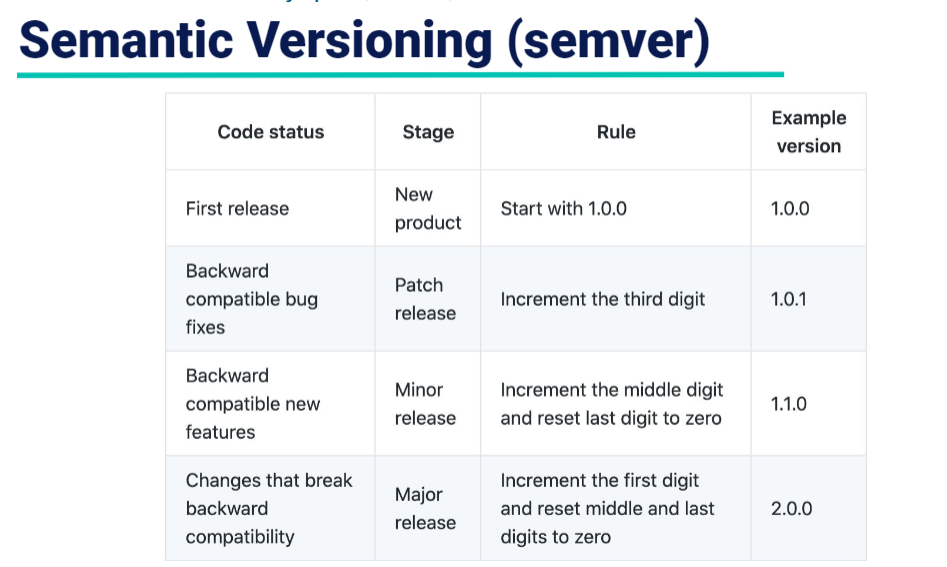
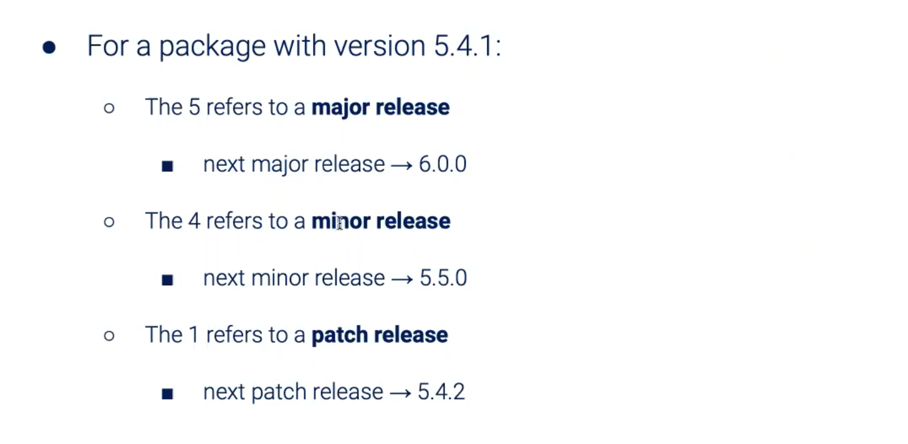

All notes are taken during Catarina Paun's CS 410 Fullstack class at PSU

---

Almost anything we can write in Javascript we can write in Node with some exceptions. Anything that uses the browser API is not going to be accessible using Node because we aren't using the browser.

An example of this is the DOM because the document object model is the browser, so we won't have access to that with Node. We can access it with JS inside the browser because we are running it in the browser, but Node runs outside a browser so it doesn't have access to the browser API.

Built-in node modules

* http: create a web server
* url: split up a web address into readable parts
* path: file and directory paths
* os: information about the current os
* fs: work with the file system

## NPM (Node.js package manager)

### Third-party packages

* Third-party packages are tracked in **package.json**

  * This file also includes project information and is structured in JSON format

  Create a package.json file with:

  ```bash
  npm init          # generates package.json with question prompts
  ```

  ```bash
  npm init --yes    # generates package.json with defaults
  ```

Output using defaults using --yes:

```json
{
  "name": "demo",
  "version": "1.0.0",
  "description": "",
  "main": "index.js",
  "scripts": {
    "test": "echo \"Error: no test specified\" && exit 1",
    "start": "node server.js"
  },
  "keywords": [],
  "author": "",
  "license": "ISC"
}
```

#### Different ways to install third-party packages

(express and mocha are used as examples below)

> npm install [package name]        # install local package

> npm install express               # install local package

> npm i express                     # install local package - shorthand

> npm i -g express                  # install global package

> npm i --save express              # install and save as a dependency

> npm i --save-dev mocha            # install and save as a dev dependency

> npm i moment lodash body-parser   # install multiple packages

#### Different ways to manage third-party packages

> npm uninstall [package]          # uninstall local package

> npm update              # update local packages

> npm audit               # see a list of vulnerabilities

> npm audit fix           # fix vulnerabilities

> npm list                # list of local packages

> npm list --depth=0      # list of local packages

> npm list -g             # list of global packages

> npm list -g --depth=0   # list of global packages

#### Dependencies

```json
{
  "name": "node-hello-world",
  "version": "1.0.0",
  "description": "This is a hello world project in Node.js",
  ...
  "author": "Caterina Paun",
  "license": "MIT",
  "devDependencies": {
    "mocha": "^7.0.1",
    "nodemon": "^2.0.20"
  },
  "dependencies": {
    "express": "^4.17.1"
  }
}
```

The above shows the devDependencies (which here is listed as mocha 7.0.1) and regular dependencies (which here is listed as express 4.17.1)

*NOTE: using the carat ^ before the version means that other versions can be used, too. Any other MINOR RELEASE version can be used*

* Dev Dependencies:
  * Needed ONLY when developing the application. Not needed to run the application.
    * EXAMPLES
      * Mocha: An example here might be using Mocha for testing. You would need it when you're running tests during development, but the user won't need it because they don't do the software testing.
      * Nodemon: Usually you have to stop and restart a server every time a change is made, but with nodemon that process happens automatically.
* Regular Dependencies:
  * Needed when running the application not just when developing

The entire structure of dependencies are available within the node_modules folder which gets installed when you use npm install

##### Gitignore:

You will always want to ignore your node_modules folder because they can be rebuilt so we don't need to copy them around.

#### package-lock.json

* npm 5 introduced the package-lock.json file, which keeps track of the exact version of every package and dependency.
  * Projects can be reproduced 100%, even if the packages have changed.
  * Includes teh dependencies of dependencies.
* The package-lock.json file should be tracked via Git.
  * Running `npm install` will install dependencies in the `node_modules/` folder.
  * It is good practice to add the `node_modules/` folder to the `.gitignore` file.

#### Semantic Versioning



Above gives guidelines on semantic versioning.




#### Running tasks with npm

* In package.json, we can specify various command line tasks that can be executed

> npm [taskname]

or

> npm run [taskname]

* This is best used for commands that might be long and/or easy to mistype.

Below you can see an example of implementing scripts with node like `start` and `dev` that will run when you use `npm start` or `npm dev`

```json
{
  "name": "demo",
  "version": "1.0.0",
  "description": "",
  "main": "isrc/server.js",
  "scripts": {
    "test": "echo \"Error: no test specified\" && exit 1",
    "start": "node src/server.js",
    "dev": "nodemon src/server.js"
  },
  "keywords": [],
  "author": "",
  "license": "ISC",
  "devDependencies": {
    "nodemon": "^7.0.1"
  }
}
```

*It's highly recommended to have a `start` included so that developers can just run `npm start`. It will often be assumed to be included. `index.js` was moved to /src and the package.json file was edited to add start command which can be run using `npm start` or `npm run start`. Also created added a `dev` command which will run the application using node mon (node mon will leave the server up but automatically refresh the contents when the file contents change). The dev version can be run using `npm run dev`. It does not seem to be able to run for me using just `npm dev`, however.*

* npx is a powerful command that was introduced in npm 5.2 to execute packages.
* We can run a command without installing anything first and we can select versions of the package using @version.
  * Not all packages need to be installed
  * i.e. `npx create-react-app my-react-appx`

Npx is really useful because sometimes you dont need a full package. With npx you can just execute it with the parts you need.

## Yarn

* Yarn is an alternative to npx; also uses the npm registry.
  * Yarn used to be more popular than npx because it was a little faster, but they're about the same speed now.
  * Yarn caches every package it downloads and it offers parallel download for packages which is important for when you use large packages or lots of different dependencies that you need to get installed quickly.
  * Both yarn and npx use the npm registry, so they're still the same generally underneath.
* It also generates a yarn.lock and package.json file

## Nodemon

* When workign with a server script, any changes we make require that we stop and restart the server to see the changes.
* The nodemon package automatically restarts the server script whenever there are changes.

See example below `package.json` file that incorporates nodemon:

```json
{
  "name": "node-hello-world",
  "version": "1.0.0",
  "description": "This is a hello world project in Node.js",
  "main": "index.js",
  "scripts": {
    "start": "node index.js",
    "dev": "nodemon index.js"
  },
  "author": "Caterina Paun",
  "license": "MIT",
  "devDependencies": {
    "nodemon": "^7.0.1"
  }
}
```

## Node.js Debugger

Since we don't use the browser API with node, we won't be able to see `console.log()` statements in the browser console. Now we need to open up a Node.js tab in our dev tools. We can do that by adding the `--inspect` or `--inspect-brk` flags when we run our application.

* There is a debugging client in Chrome DevTools and VS Code.
* Use the inspect flag to open a connection for debugging.

> node --inspect index.js

> node --inspect-brk index.js


## Modules

The CommonJS module specification is the standard used in npm for working with modules (as opposed to ES6 modules, which are used in the browser).

Built-in module system is accessible through the `modules.exports` API.

"Modules" and "packages" are often referred to interchangably. They are very similar but there are some differences between them.
