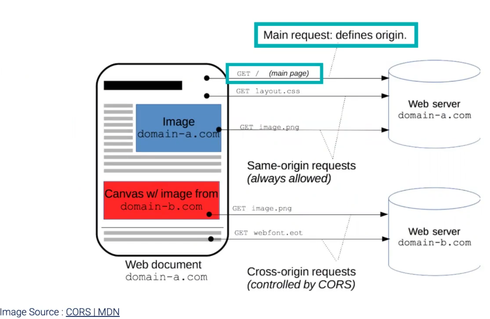

# Notes on Express.js

*All notes taken during Catarina Paun's fullstack class at PSU. All code examples are from her lecture slides!*

## What is Express.js?

Express is a third-party module that is not included with node but can be installed with either `npm` or `yarn`

* Express is a minimal and flexible Node.js web application framework that provides a robust set of features for web and mobile applications.
* Express is built on top of Node to provide more functionality, especially in terms of building web servers.
* Express is primarily used as a routing and middleware web framework -> an Express application is a series of middleware function calls.

It's also an open-source project on github!

Though we are working with Express.js here, there are multiple frameworks built on top of Node.js that add functionality and can be easier to work with:

* Express.js
* Next.js
* Meteor.js
* Koa.js
* Sails.js

#### What's an example of using Express?

Let's say we want to build some routes. In node we would have to check with if statements for GET and POST etc to find out what kind of request it is. But routing is something that happens a lot so what is Express does is it puts the routes together much more quickly. Express does a bunch of node code behind the scenes to do this.

## Setting up a Server in Express

* To install using npm:

  > npm install express
  >
* To install using yarn:

  > yarn add express
  >
* The app in `notes/fullstack-examples/express/01-hello-world.js` starts a server and listens on port 5001 for connections
* The app responds with "Hello World!" for requests to the root URL (/) or route.
* Click on the URL shown to see the app: [http://localhost:5001](https://localhost:5001) once the app is started
* The req (request) and res (response) are the exact same objects that Node.js provides, so you can invoke anything that works with Node.

## Routing with Express.js

* Routing refers to how an application responds to a client request at a particular endpoint, using a particular HTTP method (GET, POST, DELETE, etc).
* Each route has one or more handler functions that are executed.

Example code below:

```js
const express = require('express');

const app = express();
const port = process.env.PORT || 5001;

app.get('/', (req, res) => {
  res.status(200);
  res.set({ 'Content-Type': 'text/plain' });
  res.send('Hello World, Express!');
});

app.get('/about', (req, res) => {
  res.status(200);
  res.set({ 'Content-Type': 'text/html' });
  res.send('This is the about page');
});

app.get('/contact', (req, res) => {
  res.status(200);
  res.set({ 'Content-Type': 'text/html' });
  res.send('This is the contact page');
});

app.listen(port, () => {
  console.log(`Server running at http://localhost:${port}`);
});

```

The HTTP method have their own methods in express. When we use `app.get` that will be listening for a `GET` method on the route. If we wanted to listen for a `POST` as well, for example, we would need to use the appropriate method.

### Routing: Different Methods

General form:

> APP.METHOD(PATH, HANDLER)

Some of the most specific routing methods:

```js
// GET method route to / endpoint
app.get('/', (req, res) => { res.send('Hello World!') });
```

```js
// POST method route to / endpoint
app.post('/', (req, res) => { res.send('Got a POST request') });
```

```js
// PUT method route to /user endpoint
app.put('/user', (req, res) => { res.send('Got a PUT request at /user') });
```

```js
// DELETE method route to /user endpoint
app.delete('/user', (req, res) => { res.send('Got a DELETE request at /user') });
```

The handler is what actually happens when we run the response. In the above examples we're just using res.send, but often we will be returning files or various data, etc.

### Dynamic Routing

Dynamic routing will create routes programmatically.

Here is an example of dynamic routing taken from `/notes/fullstack-examples/express/03-dynamic-routing.js` that demonstrates a route that is created dynamically for each of the characters in the `characters.js` file.

```js
const express = require('express');
const characters = require('./characters');

const app = express();
const port = process.env.PORT || 5001;

let getCharacters = () => {
  let result = '';

  characters.forEach((elem) => {
    console.log(elem.name);
    result += `<li><a href="/${elem.name}">${elem.name}</a><br></li>`;
  });

  return result;
};

app.get('/', (req, res) => {
  let result = getCharacters();

  res.status(200);
  res.set({ 'Content-Type': 'text/html' });
  res.write(`<h2>Star Wars Characters</h2>`);
  res.write(`<ul>`);
  res.write(result);
  res.write(`</ul>`);
  res.end();
});

// THE BELOW IS WHERE THE DYNAMIC ROUTING IS COMING FROM!
// We are setting up a route for each of the characters!
app.get('/:character', (req, res) => {
  res.status(200);
  res.set({ 'Content-Type': 'text/plain' });
  res.write(`This is the ${req.params.character} page.`);
  res.end();
});

app.listen(port, () => {
  console.log(`Server running at http://localhost:${port}`);
});

```

## Middleware

#### What's middleware?

Middleware is basically everything that needs to happen on the backend in between getting our request and sending our response back. It is an umbrella term for things like authentication, logging, parsing, etc.

* Middleware refers to any functions that are executed during the lifecycle of a request before a response is sent back to the client.
* Each middleware function receives the **request** and **response** objects and can modify them.
* Middleware functions can either terminate the request or pass it on to another middleware function using `next()`.
* The **"chaining"** of functions allows us to separate our code and create reusable middleware.

Simplified illustration of the client server request


#### Some server tasks we may want to perform

* Parse request
* Execute code
* Make changes to the request and the response objects.
* Call the next middleware function in the stack.
* Send the response.

##### Middleware and Routing

**Middleware will execute for every single route!** So you place the middleware between the top of the page and your routes, and those middleware will execute first in order from top to bottom.

#### Middleware Uses

Some different ways that middleware is often used:

* Logging a request
* Authorization
* Serving a static file
* Intercepting request
* Compiling SASS files and serving CSS

#### Using Middleware

* Invoke middleware using `app.use()`
* This function has three parameters: `req`, `res`, and the `next()` callback
  * `app.use(req, res, next)`
  * `next()` -> function that passes control to the next item of middleware.

*Remember: a "callback" in JavaScript is "a function which is to be executed after another function has finished execution." You often pass these as arguments to other functions so that it can run the function when it has completed.*

#### Middleware Example

Below is a code example of using middleware from `/notes/fullstack-examples/express/04-middleware.js`. The `app.use()`

Below you can see that since the requests get built from top to bottom, the middleware "functions" run first, logging the URL and the  request headers before then getting the route for whatever `PATH` we're at. We define these middleware ourselves here, but often they can also be things called

```js
const express = require('express');

const app = express();
const port = process.env.PORT || 5001;

// Middleware that logs the service url
app.use((req, res, next) => {
  console.log('========== Logging Service: URL ==========');
  console.log(req.url);
  next();
});

// Middleware that logs the request headers
app.use((req, res, next) => {
  console.log('========== Logging Service: Request Headers ==========');
  console.log(`Logging JUST the host: ${req.headers.host}`);
  console.log(`Logging the full header:`);
  console.log(req.headers);
  next(); // next() still required in order to move onto the routing section below! Without it the page will hang.
});

// GET route for the root index page
// Here the next function is defined but not used. Included to show that it can be a parameter, though.
app.get('/', (req, res, next) => {
  console.log('GET route - main');
  res.send('This is the main route in the 04-middleware example');
});

// GET route for the /about page
app.get('/about', (req, res, next) => {
  console.log('GET route - about');
  res.send('This is the about route');
});

app.listen(port, () => {
  console.log(`Server running at http://localhost:${port}`);
});

```

### CORS (a type of middleware)

* **CORS** is a Node.js package for providing Express middleware that can be used to enable CORS, or "Cross-Origin Resource Sharing", with various options.
* **Cross-Origin Resource Sharing (CORS)** is a mechanism that uses additional HTTP headers to tell browsers to give a web application running at one origin, access to selected resources from a different origin.
  * CORS exists for security purposes! Consider: there are obviously no security issues if the client that initiates the request has the same origin as the server. But **if the origin is different** we want to put some restrictions in place so the client can't just have access to whatever data. We want to restrict data access.
    * We can accomplish this through the setting of additional http header information!

Diagram of CORS request



##### What is an origin?

It's the domain the request comes from and is listed in the request header. An HTTP request always has to be initiated **by the client**. So the client is going to have a specific domain. In the above image the client will have the domain of `domain-a.com`.

##### Same-origin requests

In the first step of the above diagram, the client (who is currently on `domain-a.com`) sends a `GET` request to the web server (that, in this example, is also on `domain-a.com`) for the contents of page `/`. **Requests on the same origin are always allowed**

##### Cross-origin requests (CORS)

With cross-origin requests, the domain that originates the request and the domain that sends the response are different. So, basically, this is when one site needs something from another location. For example, in the above diagram, both the `GET image.png` and `GET webfont.eot` requests in the above diargram originate from `domain-a.com` but the resources actually live at `domain-b.com`. This is an example of a cross-originn request from `domain-a.com`to`domain-b.com`. The client-side is what is going to handle cross-origin policy.

#### CORS Headers

* With CORS headers, we can let one domain tell the browser that another domain is allowed to make requests to it:
  * **Request**
    * As part of the http request the client is going to send an origin (let's say they send localhost:4000)
      * `Origin: http://localhost:4000`
  * Response
    * The server can respond in one of two ways:
      * It can respond to allow ALL origins. All origins can make the request.
        * `Access-Control-Allow-Origin:*`
      * It can limit the origins that it's willing to allow. Below it only allows localhost:4000
        * `Access-Control-Allow-Origin: http://localhost:4000`

##### CORS - Set Header example:

How to allow all origins:

```js
const express = require('express');
const app = express();

// Allows all origins to request the '/' page
app.get('/', (req, res) => {
  res.header({ 'Access-Control-Allow-Origin': '*' });
  res.end();
});
```

How to use CORS on some routes but not others:

```js
const express = require('express');
const cors = require('cors');

const app = express();
const port = process.env.PORT || 5001;

// Uncommenting the below would implement cors as middleware, 
// giving CORS access to all routes.
// app.use(cors());

app.get('/without-cors', (req, res, next) => {
  res.write('Route without CORS.');
  res.end();
});

// With this we will see in the response header Access-Control-Allow-Origin: *
// It sets the cors() as middleware on only one route
app.get('/with-cors', cors(), (req, res, next) => {
  res.write('Route with CORS');
  res.end();
});

app.listen(port, () => {
  console.log(`Server running at http://localhost:${port}`);
});

```

##### CORS with options

An easy way to set options for CORS is using an options object like below:

```js
// Adapted from both lecture and https://github.com/expressjs/cors
var corsOptions = {
  origin: 'http://originSetInCorsOptions.co.uk.gov.com',
  optionsSuccessStatus: 200 // some legacy browsers (IE11, various SmartTVs) choke on 204
}

// Use corsOptions when CORS is used as middleware for the /with-cors route
app.get('/with-cors', cors(corsOptions), (req, res, next) => {
  res.write('Route with CORS');
  res.end();
});
```

##### CORS with dynamic origins

See below an example of working with CORS when there is a dynamic origin

```js
const express = require('express');
const cors = require('cors');
const app = express();

// This whitelist will be the domains that can send requests
const whitelist = [ 'http://domain-a.com', 'http://domain-b.com' ];

const corsOptions = {
  oriting: (origin, callback) => {
    // If the origin is in the whitelist
    if (whitelist.indexOf(origin) !== -1 {
      callback(null, true)
    }
    // If the origin is not in the whitelist
    else {
      callback(new Error('Not allowed by CORS'))
    }
  }
}
```

### Serving Static Files with Middleware

Often, when the client makes a request what we will be sending back are actual files (.html, .css, .jpg, .eot, etc)

* The Express.js static middleware can serve static files, such as images, CSS files, JavaScript files, or any files in a directory.
* We setup the routing in a specific order, which you can see in the example below.

#### Express static files example

In the below example, notice that we don't have to import the static module explicitly. However, we often need a path, so we do require the path module here with `const path = require('path');`.

There are two sets of about.html and index.html files for the below example. The file structure in the example is:

> /06-static-files.js
>
> /public/
> /public/about.html
> /public/index.html
>
> /public/files/about.html
> /public/files/index.html

```js
const express = require('express');
const path = require('path');

const app = express();
const port = process.env.PORT || 5001;

// Middleware is used to serve static files. 
// You don't have to specify the file location when it is the index.html.

// public folder contains static file(s) that will be served
// /public/index.html route will automatically be set up if it exists
app.use(express.static('public'));

// specify the URL route and the file structure route
// /public/files/index.html route will automatically be set up if it exists
app.use('/files', express.static('public/files'));

// Routes to files besides index.html need to be set up manually

// Create route to /public/about.html
// send a specific file to be served to the client
app.get('/about', (req, res) => {
  // using path here allows us to get the full actual path name.
  // We send it back using res.sendFile()
  res.sendFile(path.join(__dirname + '/public/about.html'));
});

// Create route to /public/files/about.html
// send a specific file to be served to the client
app.get('/files-about', (req, res) => {
  // using path here allows us to get the full actual path name.
  // We send it back using res.sendFile()
  res.sendFile(path.join(__dirname + '/public/files/about.html'));
});

app.listen(port, () => {
  console.log(`Server running at http://localhost:${port}`);
});

```

You can see that the index pages are set up automatically when the folders are added. Even though neither is explicitly set up:

* Going to `localhost:5001` will load `/public/index.html`
* Going to `localhost:500l/files` will load `/public/files/index.html`

### Sessions and Middleware

When you visit a website information is stored about your visit and interactions on the site. Sessions help us handle cookies in express.

* The `session` module automatically stores and loads client sessions.
* This is one way we can handle cookies.
  * Cookies are like long strings and that can be hard to deal with. So sessions are an approach to storing data like cookies that's easier to work with.

#### Code example of sessions

```js
const express = require('express');
const session = require('express-session');

const app = express();
const port = process.env.PORT || 5001;

app.use(
  session({
    store: new session.MemoryStore(),
    secret: 'a secret to sign the cookie',
    resave: false,
    saveUninitialized: false,
    cookie: {
      maxAge: 86400000,
    },
  })
);

app.get('/', (req, res) => {
  res.status(200);
  res.set({ 'Content-Type': 'text/plain' });
  // If the "example" is undefined (it doesn't exist in the session)
  if (req.session.example === undefined) {
    // Initialize "example" as an empty array in the session. This gives it an entry.
    req.session.example = [];
    // Send message displayed only for new visitors once during a session
    res.send('you must be new');
  } 
  // Otherwise, there is some entry for "example" in the session
  else {
    // Add a random number to "example" (push onto stack?)
    req.session.example.push(Math.random());
    // Join the entries in "example" into a string, separated by newlines and send it
    res.send(req.session.example.join('\n'));
  }
});

app.listen(port, () => {
  console.log(`Server running at http://localhost:${port}`);
});

```

### Using Middleware to handle `POST` requests

* With Node.js, we read the input stream to get the post data.
* With Express, we use middleware to handle the stream.
  * [https://www.tutorialspoint.com/nodejs/nodejs_streams.htm](https://www.tutorialspoint.com/nodejs/nodejs_streams.htm)

    * "Streams are objects that let you read data from a source or write data to a destination in continuous fashion."
  * [https://nodejs.org/api/stream.html#stream](https://nodejs.org/api/stream.html#stream)

    * There are four fundamental stream types within Node.js:
      * `Writable`: streams to which data can be written (for example, `fs.createWriteStream()`).
      * `Readable`: streams from which data can be read (for example, `fs.createReadStream()`).
      * `Duplex`: streams that are both Readable and Writable (for example, `net.Socket`).
      * `Transform`: Duplex streams that can modify or transform the data as it is written and read (for example, `zlib.createDeflate()`).
    * Additionally, this module includes the utility functions `stream.pipeline()`, `stream.finished()`, `stream.Readable.from()` and `stream.addAbortSignal()`.

The input stream is not formatted. Only by parsing it are we going to get the POST data as we want it. Express makes this easy using the `body-parser` module!rt = process.env.PORT || 5001;

```js
const express = require('express');

const app = express();
const port = process.env.PORT || 5001;

app.use(
  express.urlencoded({
    extended: true,
  })
);

// We sent the entire form as html here
app.get('/form', (req, res) => {
  res.status(200);
  res.set({ 'Content-Type': 'text/html' });
  // When the form is submitted we make a POST request to /submit
  res.write('<form action="/submit" method="post">');
  res.write('<label for="name">Name: </label>');
  res.write('<input type="text" name="name" id="name"><br />');
  res.write('<label for="email">Email: </label>');
  res.write('<input type="email" name="email" id="email"><br />');
  res.write('<input type="submit">');
  res.write('</form></body></html>');
  res.end();
});

app.post('/submit', (req, res) => {
  // req.body will have all of the information that the user entered.
  console.log(req.body);
  console.log(`Name: ${req.body.name}`);
  console.log(`Email: ${req.body.email}`);
  res.end();
});

app.listen(port, () => {
  console.log(`Server running at http://localhost:${port}`);
});
```
